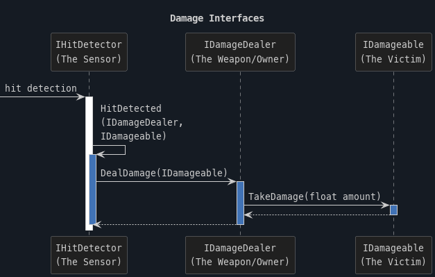

# Damage

The damage system determines how a game entity defined as Damageable takes damage from another entity defined as DamageDealer upon hit detection.
The entity who's responsible for detecting the hit is the HitDetector.

