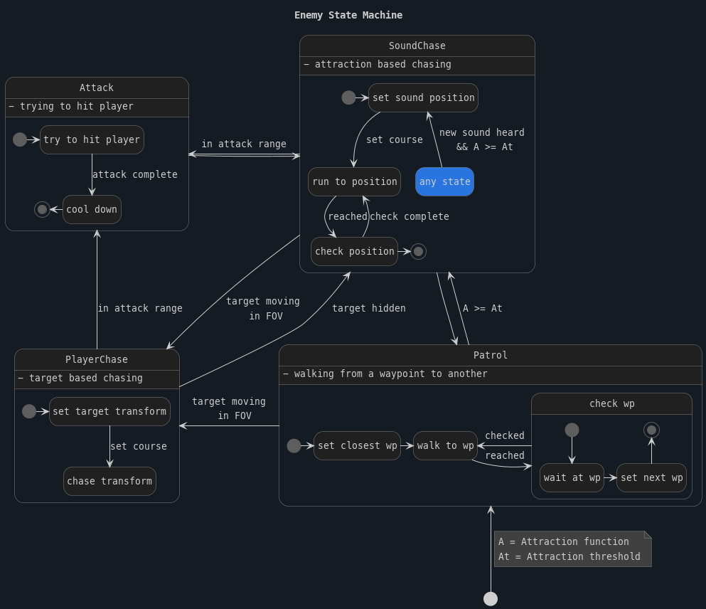

# Enemies

## Enemy State Machine

The enemy AI operates based on a state machine that defines its behavior in response to various stimuli, primarily sound. The main states include:

- **Patrol**: the enemy move along predefined paths, defined by waypoints.
- **SoundChase**: the enemy runs toward the last known position of a sound that attracted its attention.
- **PlayerChase**: the enemy actively pursues the player upon visual confirmation.
- **Attack**: the enemy tries to hit the player when in range.

