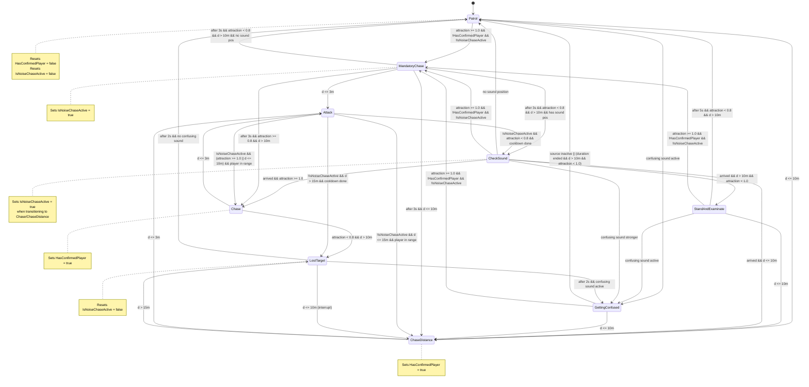

# Schema Architetturale AI Nemico (Troll)

## 1. Panoramica Architetturale

### Componenti Principali

L'AI del nemico è strutturata secondo un pattern **State Machine** (FSM - Finite State Machine) che separa la logica di comportamento in stati discreti e gestisce le transizioni tra di essi.

#### **EnemyAI** (Componente MonoBehaviour)
- **Ruolo**: Componente principale che coordina l'intero sistema AI
- **Responsabilità**:
  - Gestisce il calcolo centralizzato dell'**attraction** (valore di attrazione basato su rumore/azioni del player)
  - Mantiene riferimenti a NavMeshAgent, Animator, AudioSource
  - Espone metodi pubblici per gli stati (es. `GetAttraction()`, `GetSoundPosition()`, `FindNearestConfusingSoundSource()`)
  - Gestisce eventi esterni (SOPlayerActionEvent) e notifica eventi interni (SOEnemyIAEvent, SONewAudioSphereEvent)
  - Aggiorna la FSM ogni frame passando il valore di attraction calcolato

#### **EnemyFSM** (Classe serializzabile)
- **Ruolo**: Gestore della state machine
- **Responsabilità**:
  - Mantiene tutti gli stati istanziati
  - Gestisce le **transizioni globali** (trigger che possono interrompere qualsiasi stato):
    - **MandatoryChase**: quando `attraction >= NoiseThreshold` (1.0) e `!HasConfirmedPlayer && !IsNoiseChaseActive`
    - **ChaseDistance**: quando `d <= D_enter` (10m) da qualsiasi stato non-chase
  - Esegue `Update()` sullo stato corrente passando l'attraction
  - Gestisce il cambio di stato con `SwitchState()`

#### **EnemyState** (Classe base astratta)
- **Ruolo**: Classe base per tutti gli stati concreti
- **Metodi astratti**:
  - `Enter()`: chiamato quando si entra nello stato
  - `Update(float attraction)`: chiamato ogni frame con il valore di attraction corrente
  - `Exit()`: chiamato quando si esce dallo stato
  - `OnPlayerHit()`: gestisce l'evento di colpo al player (ritorna `true` se gestito)
- **Metodi helper**: animazioni comuni (StandAndExamine, LostTarget, Confused)

#### **Stati Concreti**
Ogni stato rappresenta un comportamento specifico del nemico:

1. **PatrolEnemyState**: pattugliamento tra waypoints
2. **StandAndExaminateState**: sospetto prima della conferma del player (solo se `HasConfirmedPlayer == false`)
3. **CheckSoundState**: movimento verso la posizione dell'ultimo suono
4. **GettingConfusedState**: distrazione verso fonti di suono confuse (radio, speaker, ecc.)
5. **MandatoryChaseState**: inseguimento garantito per 3 secondi quando attraction supera la soglia
6. **ChaseEnemyState**: inseguimento basato su attraction (rumore)
7. **ChaseDistanceState**: inseguimento basato solo su distanza (prossimità)
8. **AttackEnemyState**: attacco al player
9. **LostTargetState**: perdita del target dopo un vero chase

#### **ScriptableObject: SOEnemyData**
- **Ruolo**: Contiene tutti i parametri configurabili del nemico
- **Parametri principali**:
  - **Distanze**: `D_enter` (10m), `D_exit` (15m), `AttackRange` (3m)
  - **Velocità**: `ChaseSpeed`, `PatrolSpeed`
  - **Soglie rumore**: `NoiseThreshold` (1.0), `NoiseLoseThreshold` (0.8)
  - **Parametri calcolo attraction**: `NoiseIntensityFactor`, `NoiseRangeFactor`, `NoiseDistanceDecay`, `NoiseDecayRate`
  - **Audio clips**: `SuspicionPhrases`, `LostTargetPhrases`, `InvestigationPhrases`
  - **Parametri suoni confusi**: `ConfusingSoundDetectionRange`, `ConfusingSoundDuration`

#### **Eventi (ScriptableObject Events)**
- **SOEnemyIAEvent** (alias `EnemyAISO`): evento sollevato quando il nemico colpisce il player
- **SONewAudioSphereEvent**: evento per emettere suoni dal nemico (sistema di echolocation)
- **SOPlayerActionEvent**: evento osservato quando il player compie un'azione (colpisce oggetti, ecc.)

### Flusso Generale

1. **EnemyAI.Update()** ogni frame:
   - Aggiorna la durata dell'azione del player attiva
   - Calcola `attraction` usando la formula centralizzata (accumulo quando c'è un'azione, decay quando non c'è)
   - Notifica l'UI con il valore di attraction
   - Chiama `_fsm.Update(_attraction)`

2. **EnemyFSM.Update(attraction)**:
   - Controlla i **trigger globali** (MandatoryChase, ChaseDistance)
   - Se nessun trigger globale scatta, chiama `CurrentState.Update(attraction)`

3. **Stato corrente.Update(attraction)**:
   - Esegue la logica specifica dello stato
   - Può chiamare `_fsm.SwitchState()` per cambiare stato in base a condizioni locali

4. **Transizioni**:
   - Alcune transizioni sono gestite **globalmente** dalla FSM (MandatoryChase, ChaseDistance)
   - Altre sono gestite **localmente** dagli stati (es. Chase → Attack quando `d <= AttackRange`)

---

## 2. Descrizione di Ogni Stato

### **PatrolEnemyState**

**Scopo**: Il nemico pattuglia tra waypoints in modo ciclico, fermandosi brevemente ad ogni waypoint.

**Enter()**:
- Resetta `HasConfirmedPlayer = false` e `IsNoiseChaseActive = false`
- Disabilita il collider di attacco
- Avvia il movimento verso il prossimo waypoint

**Update(attraction)**:
- Muove il nemico verso il waypoint corrente
- Quando raggiunge un waypoint, attende per `WaypointPauseDuration` secondi
- Controlla se deve essere distratto da un suono confuso → `GettingConfusedState`
- Le transizioni verso MandatoryChase e ChaseDistance sono gestite dai trigger globali della FSM

**Exit()**:
- Resetta i timer di attesa

**Parametri chiave**: `PatrolSpeed`, `WaypointPauseDuration`, `WaypointArrivalThreshold`

---

### **StandAndExaminateState**

**Scopo**: Stato di **sospetto prima della conferma del player**. Il nemico ha solo sentito qualcosa, non ha ancora fatto un vero chase. Usato solo quando `HasConfirmedPlayer == false`. Emette frasi come "Mi sembrava di sentire qualcosa...", "Strano...".

**Enter()**:
- Verifica che `HasConfirmedPlayer == false` (altrimenti errore)
- Salva la posizione del suono da esaminare
- Ferma il nemico e avvia l'animazione "StandAndExamine"
- Riproduce una frase di sospetto (con cooldown per evitare spam)
- Emette un suono di investigazione per il sistema di echolocation

**Update(attraction)**:
- Il nemico resta fermo per `EXAMINATION_DURATION` (5 secondi)
- Dopo la durata, controlla:
  - Se `attraction < NoiseLoseThreshold` (0.8) **E** `d > D_enter` (10m) → `PatrolState`
  - Altrimenti continua a esaminare
- Controlla se deve essere distratto da un suono confuso → `GettingConfusedState`
- Le transizioni verso MandatoryChase e ChaseDistance sono gestite dai trigger globali

**Exit()**:
- Ferma eventuali audio in riproduzione
- Ripristina il movimento dell'agent

**Parametri chiave**: `NoiseLoseThreshold`, `D_enter`, `InvestigationSoundRadius`, `InvestigationSoundIntensity`, `InvestigationSoundDuration`, `InvestigationSoundFrequency`

---

### **CheckSoundState**

**Scopo**: Il nemico si muove verso la posizione dell'ultimo suono rilevato. Quando arriva, decide se entrare in chase o in StandAndExamine.

**Enter()**:
- Ottiene la posizione del suono da `GetSoundPosition()` (ultima posizione di azione del player)
- Se non c'è posizione valida → `PatrolState`
- Imposta la destinazione NavMesh verso la posizione del suono
- Avvia l'animazione di movimento

**Update(attraction)**:
- Muove il nemico verso la posizione del suono
- Quando arriva entro `ARRIVAL_DISTANCE` (2m):
  - Ferma il nemico
  - Controlla le condizioni:
    - Se `d <= D_enter` (10m) → `ChaseDistanceState` (imposta `IsNoiseChaseActive = true`)
    - Se `attraction >= NoiseThreshold` (1.0) → `ChaseEnemyState` (imposta `IsNoiseChaseActive = true`)
    - **Altrimenti** → `StandAndExaminateState` (sempre, non va più direttamente in Patrol)
- Durante il movimento, può essere distratto da un suono confuso se più forte dell'attraction corrente → `GettingConfusedState`

**Exit()**:
- Resetta i flag di arrivo

**Parametri chiave**: `D_enter`, `NoiseThreshold`, `ARRIVAL_DISTANCE` (costante 2m)

---

### **GettingConfusedState**

**Scopo**: Il nemico è attratto da una fonte di suono confusa (radio, speaker, ecc.) e si muove verso di essa. Quando arriva, resta confuso per una durata.

**Enter()**:
- Trova la fonte di suono confusa più vicina entro `ConfusingSoundDetectionRange`
- Se non c'è fonte attiva → `PatrolState`
- Imposta la destinazione verso la posizione della fonte
- Avvia l'animazione "Confused"

**Update(attraction)**:
- Muove il nemico verso la fonte confusa
- Se la fonte si disattiva → esce dallo stato
- Se `d <= D_enter` (10m) → `ChaseDistanceState` (interruzione per prossimità)
- Se `attraction >= NoiseThreshold` (1.0) → `MandatoryChaseState` (interruzione per rumore alto)
- Quando arriva entro `ARRIVAL_DISTANCE` (2m):
  - Ferma il nemico
  - Resta confuso per `ConfusingSoundDuration` secondi
- Dopo la durata, esce controllando:
  - Se `d <= D_enter` → `ChaseDistanceState`
  - Se `attraction >= NoiseThreshold` → `MandatoryChaseState`
  - Altrimenti → `PatrolState`

**Exit()**:
- Resetta i flag di confusione

**Parametri chiave**: `ConfusingSoundDetectionRange`, `ConfusingSoundDuration`, `D_enter`, `NoiseThreshold`

---

### **MandatoryChaseState**

**Scopo**: Inseguimento garantito per 3 secondi quando l'attraction supera `NoiseThreshold` (1.0) per la prima volta. Serve a garantire un minimo di reazione anche se l'attraction cala rapidamente.

**Enter()**:
- Imposta `IsNoiseChaseActive = true` (da qui in poi è un noise-chase)
- Ferma eventuali audio
- Avvia l'inseguimento verso il player
- Imposta la velocità di chase

**Update(attraction)**:
- Insegue sempre il player durante i 3 secondi
- Se `d <= AttackRange` → `AttackEnemyState`
- Dopo 3 secondi (`MANDATORY_CHASE_DURATION`):
  - Se `attraction >= NoiseLoseThreshold` (0.8) **O** `d <= D_enter` (10m):
    - Se `d <= D_enter` → `ChaseDistanceState`
    - Altrimenti → `ChaseEnemyState`
  - Altrimenti (non ci sono più motivi per inseguire):
    - Se c'è una posizione suono valida → `CheckSoundState`
    - Altrimenti → `PatrolState`

**Exit()**:
- Nessun cleanup particolare

**Parametri chiave**: `NoiseThreshold`, `NoiseLoseThreshold`, `D_enter`, `AttackRange`, `MANDATORY_CHASE_DURATION` (costante 3s)

---

### **ChaseEnemyState**

**Scopo**: Inseguimento basato su **attraction** (rumore). Il nemico insegue il player finché l'attraction rimane alta o il player è vicino.

**Enter()**:
- Imposta `HasConfirmedPlayer = true` (il nemico ha confermato l'esistenza del player)
- Ferma eventuali audio
- Avvia l'inseguimento verso il player
- Imposta la velocità di chase

**Update(attraction)**:
- Insegue il player
- Se `d <= AttackRange` → `AttackEnemyState`
- Continua a inseguire se:
  - `attraction >= NoiseLoseThreshold` (0.8) **OPPURE**
  - `d <= D_enter` (10m)
- Esce solo quando: `attraction < NoiseLoseThreshold` **E** `d > D_enter` → `LostTargetState`

**Exit()**:
- Nessun cleanup particolare

**Parametri chiave**: `NoiseLoseThreshold`, `D_enter`, `AttackRange`, `ChaseSpeed`

---

### **ChaseDistanceState**

**Scopo**: Inseguimento basato **solo su distanza** (prossimità). Ignora l'attraction, insegue se il player è entro `D_enter` (10m) e si ferma quando supera `D_exit` (15m).

**Enter()**:
- Imposta `HasConfirmedPlayer = true`
- Ferma eventuali audio
- Avvia l'inseguimento verso il player
- Imposta la velocità di chase

**Update(attraction)**:
- Insegue sempre il player (ignora attraction)
- Se `d <= AttackRange` → `AttackEnemyState`
- Se `d > D_exit` (15m) → `LostTargetState` (ha perso il player)

**Exit()**:
- Nessun cleanup particolare

**Parametri chiave**: `D_enter`, `D_exit`, `AttackRange`, `ChaseSpeed`

---

### **AttackEnemyState**

**Scopo**: Il nemico attacca il player quando è entro `AttackRange`. Dopo l'attacco, decide come continuare in base a `IsNoiseChaseActive` e alle condizioni.

**Enter()**:
- Avvia la coroutine `AttackRoutine()`:
  - Attiva l'animazione di attacco
  - Ferma il movimento
  - Dopo `AttackDamageDelay`, abilita il collider di danno per `AttackDamageWindowTime`
  - Dopo `AttackDuration`, termina l'animazione e imposta `_attackEnded = true`

**Update(attraction)**:
- Durante l'attacco, ruota verso il player
- Dopo l'attacco (`_attackEnded == true`):
  - Se il player è ancora in range di chase (entro `D_exit` se `HasConfirmedPlayer`, altrimenti `D_enter`) e è passato almeno 0.1s:
    - **Skip cooldown** e riprendi immediatamente:
      - Se `IsNoiseChaseActive` → `ChaseEnemyState`
      - Altrimenti → `ChaseDistanceState`
  - Altrimenti, aspetta il cooldown completo (`AttackCoolDown`):
    - **Se `IsNoiseChaseActive == true`** (chase nato da rumore):
      - Se `attraction >= NoiseThreshold` **O** `d <= D_enter` → `ChaseEnemyState`
      - Se `attraction < NoiseLoseThreshold` → `CheckSoundState` (va a investigare l'ultimo suono)
      - Altrimenti → `ChaseEnemyState`
    - **Se `IsNoiseChaseActive == false`** (chase nato solo da distanza):
      - Se `d <= D_exit` → `ChaseDistanceState`
      - Altrimenti → `LostTargetState`

**Exit()**:
- Disabilita il collider di attacco
- Resetta i flag di attacco

**Parametri chiave**: `AttackRange`, `AttackDuration`, `AttackDamageDelay`, `AttackDamageWindowTime`, `AttackCoolDown`, `CoolDownRotationSpeed`, `D_enter`, `D_exit`, `NoiseThreshold`, `NoiseLoseThreshold`

---

### **LostTargetState**

**Scopo**: Stato di **perdita del target dopo un vero chase**. Il nemico ha già confermato il player (`HasConfirmedPlayer == true`) ma lo ha perso. Emette frasi come "So che eri qui... ti ritroverò".

**Enter()**:
- Resetta `IsNoiseChaseActive = false` (il noise-chase è terminato)
- Avvia l'animazione "LostTarget"
- Ferma il nemico
- Riproduce una frase di perdita target
- Avvia un timer di `LOST_TARGET_DURATION` (2 secondi)

**Update(attraction)**:
- Il nemico resta fermo durante la durata
- Dopo 2 secondi:
  - Se c'è un suono confuso attivo → `GettingConfusedState`
  - Altrimenti → `PatrolState` (resetta `HasConfirmedPlayer = false` in Patrol)

**Exit()**:
- Ripristina il movimento dell'agent

**Parametri chiave**: `LOST_TARGET_DURATION` (costante 2s)

---

## 3. Tabella Condizioni di Transizione

| Stato Corrente | Nuovo Stato | Condizione | Dove è Implementata |
|----------------|-------------|------------|---------------------|
| **Patrol** | **StandAndExaminate** | *(Non gestita direttamente - transizione indiretta)* | - |
| **Patrol** | **CheckSound** | *(Non gestita direttamente - transizione indiretta)* | - |
| **Patrol** | **MandatoryChase** | `attraction >= NoiseThreshold` (1.0) **E** `!HasConfirmedPlayer` **E** `!IsNoiseChaseActive` | **FSM (trigger globale)** |
| **Patrol** | **ChaseDistance** | `d <= D_enter` (10m) | **FSM (trigger globale)** |
| **Patrol** | **GettingConfused** | `ShouldBeDistractedByConfusingSound()` == true | **PatrolEnemyState.Update()** |
| **StandAndExaminate** | **Patrol** | Dopo `EXAMINATION_DURATION` (5s): `attraction < NoiseLoseThreshold` (0.8) **E** `d > D_enter` (10m) | **StandAndExaminateState.Update()** |
| **StandAndExaminate** | **GettingConfused** | `ShouldBeDistractedByConfusingSound()` == true | **StandAndExaminateState.Update()** |
| **StandAndExaminate** | **MandatoryChase** | `attraction >= NoiseThreshold` (1.0) **E** `!HasConfirmedPlayer` **E** `!IsNoiseChaseActive` | **FSM (trigger globale)** |
| **StandAndExaminate** | **ChaseDistance** | `d <= D_enter` (10m) | **FSM (trigger globale)** |
| **CheckSound** | **Patrol** | Nessuna posizione suono valida disponibile | **CheckSoundState.Enter() / Update()** |
| **CheckSound** | **StandAndExaminate** | Arrivato alla posizione suono **E** `d > D_enter` **E** `attraction < NoiseThreshold` | **CheckSoundState.Update()** |
| **CheckSound** | **MandatoryChase** | `attraction >= NoiseThreshold` (1.0) **E** `!HasConfirmedPlayer` **E** `!IsNoiseChaseActive` | **FSM (trigger globale)** |
| **CheckSound** | **ChaseDistance** | Arrivato alla posizione suono **E** `d <= D_enter` (10m) | **CheckSoundState.Update()** |
| **CheckSound** | **Chase** | Arrivato alla posizione suono **E** `attraction >= NoiseThreshold` (1.0) | **CheckSoundState.Update()** |
| **CheckSound** | **GettingConfused** | Suono confuso attivo **E** `DistractionStrength > attraction` | **CheckSoundState.Update()** |
| **GettingConfused** | **Patrol** | Fonte confusa disattivata **O** durata confusione terminata **E** `d > D_enter` **E** `attraction < NoiseThreshold` | **GettingConfusedState.Update()** |
| **GettingConfused** | **ChaseDistance** | `d <= D_enter` (10m) | **GettingConfusedState.Update()** |
| **GettingConfused** | **MandatoryChase** | `attraction >= NoiseThreshold` (1.0) **E** `!HasConfirmedPlayer` **E** `!IsNoiseChaseActive` | **FSM (trigger globale)** |
| **MandatoryChase** | **Attack** | `d <= AttackRange` (3m) | **MandatoryChaseState.Update()** |
| **MandatoryChase** | **Chase** | Dopo 3s: `attraction >= NoiseLoseThreshold` (0.8) **E** `d > D_enter` (10m) | **MandatoryChaseState.Update()** |
| **MandatoryChase** | **ChaseDistance** | Dopo 3s: `d <= D_enter` (10m) | **MandatoryChaseState.Update()** |
| **MandatoryChase** | **CheckSound** | Dopo 3s: `attraction < NoiseLoseThreshold` **E** `d > D_enter` **E** posizione suono valida disponibile | **MandatoryChaseState.Update()** |
| **MandatoryChase** | **Patrol** | Dopo 3s: `attraction < NoiseLoseThreshold` **E** `d > D_enter` **E** nessuna posizione suono valida | **MandatoryChaseState.Update()** |
| **Chase** | **Attack** | `d <= AttackRange` (3m) | **ChaseEnemyState.Update()** |
| **Chase** | **LostTarget** | `attraction < NoiseLoseThreshold` (0.8) **E** `d > D_enter` (10m) | **ChaseEnemyState.Update()** |
| **ChaseDistance** | **Attack** | `d <= AttackRange` (3m) | **ChaseDistanceState.Update()** |
| **ChaseDistance** | **LostTarget** | `d > D_exit` (15m) | **ChaseDistanceState.Update()** |
| **Attack** | **Chase** | Dopo attacco: `IsNoiseChaseActive == true` **E** (`attraction >= NoiseThreshold` **O** `d <= D_enter`) **E** player ancora in range | **AttackEnemyState.Update()** |
| **Attack** | **ChaseDistance** | Dopo attacco: `IsNoiseChaseActive == false` **E** `d <= D_exit` (15m) **E** player ancora in range | **AttackEnemyState.Update()** |
| **Attack** | **CheckSound** | Dopo attacco: `IsNoiseChaseActive == true` **E** `attraction < NoiseLoseThreshold` **E** cooldown completato | **AttackEnemyState.Update()** |
| **Attack** | **LostTarget** | Dopo attacco: `IsNoiseChaseActive == false` **E** `d > D_exit` (15m) **E** cooldown completato | **AttackEnemyState.Update()** |
| **LostTarget** | **Patrol** | Dopo 2s: nessun suono confuso attivo | **LostTargetState.Update()** |
| **LostTarget** | **GettingConfused** | Dopo 2s: `ShouldBeDistractedByConfusingSound()` == true | **LostTargetState.Update()** |
| **LostTarget** | **ChaseDistance** | `d <= D_enter` (10m) *(interruzione durante LostTarget)* | **FSM (trigger globale)** |

---

## 4. Diagramma a Stati (Mermaid)



---

## 5. Spiegazione delle Variabili Chiave

### **`attraction`** (float)

**Definizione**: Valore di attrazione del nemico verso il player, calcolato centralmente in `EnemyAI.CalculateAttraction()`.

**Come viene calcolata**:
- **Accumulo** (quando c'è un'azione attiva del player):
  ```
  contribution = intensity * NoiseIntensityFactor * frequencyMultiplier * distanceMultiplier * Time.deltaTime
  attraction += contribution
  ```
  Dove:
  - `intensity`: intensità dell'azione (da oggetto/item usato dal player)
  - `frequencyMultiplier`: 1x (Low), 1.5x (Mid), 2x (High)
  - `distanceMultiplier = 1 / Pow((distance + 0.01) * NoiseRangeFactor, NoiseDistanceDecay)`
  
- **Decay** (quando non c'è azione attiva):
  ```
  attraction -= NoiseDecayRate * Time.deltaTime
  ```
  
- **Clamp**: `attraction = Max(0, attraction)` (mai negativo)

**Uso negli stati**:
- **NoiseThreshold** (1.0): soglia per entrare in MandatoryChase (prima volta)
- **NoiseLoseThreshold** (0.8): soglia per continuare un chase (isteresi)
- Gli stati di chase (Chase, MandatoryChase) usano `attraction` per decidere se continuare
- Gli stati di investigazione (StandAndExamine, CheckSound) usano `attraction` per decidere se tornare a Patrol

---

### **`NoiseThreshold` vs `NoiseLoseThreshold`** (Isteresi del Rumore)

**NoiseThreshold** (default: 1.0):
- **Soglia di ingresso**: quando `attraction >= NoiseThreshold`, il nemico entra in MandatoryChase (se `!HasConfirmedPlayer && !IsNoiseChaseActive`)
- Rappresenta il punto in cui il rumore diventa "abbastanza forte" da scatenare una reazione

**NoiseLoseThreshold** (default: 0.8):
- **Soglia di uscita**: quando `attraction < NoiseLoseThreshold`, il nemico può uscire da uno stato di chase (se anche `d > D_enter`)
- Rappresenta il punto in cui il rumore diventa "troppo debole" per continuare a inseguire

**Perché due soglie diverse?** (Isteresi)
- Evita il "flickering" tra stati quando l'attraction oscilla intorno a un valore
- Esempio: se `attraction` oscilla tra 0.9 e 1.0, senza isteresi il nemico entrerebbe e uscirebbe continuamente da MandatoryChase
- Con isteresi: entra a 1.0, esce solo quando scende sotto 0.8 → comportamento più stabile

---

### **`D_enter` e `D_exit`** (Isteresi sulla Distanza)

**D_enter** (default: 10m):
- **Soglia di ingresso**: quando `d <= D_enter`, il nemico entra in ChaseDistance (da qualsiasi stato non-chase)
- Rappresenta la "zona di prossimità" in cui il nemico reagisce immediatamente anche senza rumore

**D_exit** (default: 15m):
- **Soglia di uscita**: quando `d > D_exit`, il nemico esce da ChaseDistance → LostTarget
- Rappresenta la "zona di perdita definitiva" del player

**Perché due soglie diverse?** (Isteresi)
- Evita il "flickering" quando il player oscilla intorno a 10m
- Esempio: se il player oscilla tra 9.5m e 10.5m, senza isteresi il nemico entrerebbe e uscirebbe continuamente da ChaseDistance
- Con isteresi: entra a 10m, esce solo quando supera 15m → comportamento più stabile

**Uso combinato**:
- In `ChaseEnemyState`: continua se `attraction >= NoiseLoseThreshold` **OPPURE** `d <= D_enter`
- In `AttackEnemyState`: usa `D_exit` per determinare se il player è ancora in range dopo l'attacco (se `HasConfirmedPlayer == true`)

---

### **`HasConfirmedPlayer`** (bool)

**Definizione**: Flag che indica se il nemico ha **confermato l'esistenza del player** (ha fatto un vero chase).

**Quando viene settato a `true`**:
- In `ChaseEnemyState.Enter()`
- In `ChaseDistanceState.Enter()`
- *(Non in MandatoryChase perché potrebbe essere solo un "falso allarme")*

**Quando viene resettato a `false`**:
- In `PatrolEnemyState.Enter()` (quando torna a pattugliare dopo aver perso il player)

**Impatto sul comportamento**:
- **Prima della conferma** (`HasConfirmedPlayer == false`):
  - Il nemico può entrare in `StandAndExaminateState` (sospetto)
  - Può entrare in `MandatoryChase` quando `attraction >= NoiseThreshold`
  - Non può entrare in `LostTargetState` (non ha ancora fatto un vero chase)
  
- **Dopo la conferma** (`HasConfirmedPlayer == true`):
  - Il nemico non può più entrare in `StandAndExaminateState` (ha già visto il player)
  - Non può più entrare in `MandatoryChase` (ha già confermato)
  - Può entrare in `LostTargetState` quando perde il player (dopo un vero chase)

**Esempio di flusso**:
1. Player fa rumore → `attraction >= 1.0` → `MandatoryChase` (ancora `HasConfirmedPlayer == false`)
2. Dopo 3s, se continua → `ChaseEnemyState` → `HasConfirmedPlayer = true`
3. Se perde il player → `LostTargetState` (perché `HasConfirmedPlayer == true`)
4. Dopo LostTarget → `PatrolState` → `HasConfirmedPlayer = false` (reset)

---

### **`IsNoiseChaseActive`** (bool)

**Definizione**: Flag che indica se il nemico sta inseguendo il player perché ha **superato la soglia di rumore** (`NoiseThreshold`) o è arrivato da un suono investigato (`CheckSoundState`).

**Quando viene settato a `true`**:
- In `MandatoryChaseState.Enter()` (entrato per rumore alto)
- In `CheckSoundState.Update()` quando transiziona verso `ChaseEnemyState` o `ChaseDistanceState` (investigato un suono)

**Quando viene resettato a `false`**:
- In `PatrolEnemyState.Enter()` (tornato a pattugliare)
- In `LostTargetState.Enter()` (ha perso definitivamente il target)

**Impatto sul comportamento**:
- **Se `IsNoiseChaseActive == true`** (chase nato da rumore):
  - In `AttackEnemyState`: dopo l'attacco, può tornare a `ChaseEnemyState` (usa `attraction` e `NoiseThreshold`)
  - In `AttackEnemyState`: se `attraction < NoiseLoseThreshold`, può andare a `CheckSoundState` (investiga l'ultimo suono)
  - Il nemico "ricorda" che sta inseguendo per rumore, quindi può usare logica basata su `attraction`
  
- **Se `IsNoiseChaseActive == false`** (chase nato solo da distanza):
  - In `AttackEnemyState`: dopo l'attacco, può tornare solo a `ChaseDistanceState` (usa solo distanza)
  - In `AttackEnemyState`: se `d > D_exit`, va a `LostTargetState` (non ha senso investigare suoni se non era un noise-chase)
  - Il nemico "sa" che sta inseguendo solo per prossimità, quindi usa solo logica basata su distanza

**Esempio di flusso**:
1. Player fa rumore → `attraction >= 1.0` → `MandatoryChase` → `IsNoiseChaseActive = true`
2. Dopo 3s → `ChaseEnemyState` (mantiene `IsNoiseChaseActive = true`)
3. Attacca → `AttackEnemyState`
4. Dopo attacco: se `attraction < NoiseLoseThreshold` → `CheckSoundState` (va a investigare l'ultimo suono)

**Contro-esempio**:
1. Player si avvicina → `d <= 10m` → `ChaseDistanceState` (senza rumore) → `IsNoiseChaseActive = false`
2. Attacca → `AttackEnemyState`
3. Dopo attacco: se `d > D_exit` → `LostTargetState` (non va a CheckSound perché non era un noise-chase)

---

## 6. Come Riutilizzare lo Schema per Altri Nemici

### Creare un Nuovo Tipo di Nemico Modificando Solo SOEnemyData

L'architettura è progettata per essere **data-driven**: puoi creare nuovi tipi di nemici semplicemente creando nuove istanze di `SOEnemyData` con parametri diversi.

**Esempio: Nemico Veloce e Aggressivo**
- `ChaseSpeed = 7.0f` (più veloce)
- `AttackRange = 4.0f` (attacca da più lontano)
- `D_enter = 15.0f` (reagisce da più lontano)
- `NoiseThreshold = 0.7f` (più sensibile al rumore)
- `NoiseLoseThreshold = 0.5f` (continua a inseguire più a lungo)

**Esempio: Nemico Lento e Cauto**
- `ChaseSpeed = 3.0f` (più lento)
- `AttackRange = 2.0f` (attacca solo da molto vicino)
- `D_enter = 5.0f` (reagisce solo da molto vicino)
- `NoiseThreshold = 1.5f` (meno sensibile al rumore)
- `NoiseDecayRate = 0.1f` (perde interesse più velocemente)

**Esempio: Nemico con Investigazione Lunga**
- `ConfusingSoundDuration = 10.0f` (resta confuso più a lungo)
- `InvestigationSoundDuration = 2.0f` (emette suoni di investigazione più lunghi)

**Vantaggi**:
- Non serve modificare codice
- Puoi testare diversi comportamenti rapidamente
- Puoi creare varianti dello stesso nemico (es. "Troll Normale", "Troll Elite", "Troll Boss")

---

### Disattivare Transizioni o Stati

Se vuoi creare un nemico che **non usa** certi stati o transizioni, hai diverse opzioni:

#### **Opzione 1: Modificare i Trigger Globali nella FSM**

Se un nemico non deve mai entrare in `MandatoryChase`, puoi modificare `EnemyFSM.Update()` per aggiungere una condizione:

```csharp
// Esempio: nemico che ignora MandatoryChase
bool canEnterMandatoryChase = !enemyAI.HasConfirmedPlayer 
    && !enemyAI.IsNoiseChaseActive
    && enemyAI.enemyData.AllowMandatoryChase  // Nuovo flag in SOEnemyData
    && (CurrentState == patrolState || ...);
```

#### **Opzione 2: Creare Stati Specializzati**

Puoi creare nuovi stati che derivano da `EnemyState` e implementano comportamenti diversi:

```csharp
public class SimpleChaseState : EnemyState
{
    // Versione semplificata di ChaseEnemyState senza logica di CheckSound
    // ...
}
```

Poi creare una nuova FSM o modificare `EnemyFSM` per usare questi stati alternativi.

#### **Opzione 3: Usare Flag in SOEnemyData**

Aggiungi flag booleani in `SOEnemyData` per disattivare comportamenti:

```csharp
[Header("Behavior Flags")]
public bool AllowCheckSound = true;
public bool AllowGettingConfused = true;
public bool AllowStandAndExamine = true;
```

Poi modifica gli stati per controllare questi flag prima di fare transizioni.

**Esempio in `PatrolEnemyState.Update()`**:
```csharp
if (_enemyData.AllowGettingConfused && _enemyAI.ShouldBeDistractedByConfusingSound())
{
    _fsm.SwitchState(_fsm.gettingConfusedState);
    return;
}
```

---

### Creare Stati Specializzati per Nuovi Comportamenti

Se vuoi aggiungere comportamenti completamente nuovi (es. "Nemico che si nasconde", "Nemico che chiama rinforzi"), puoi:

1. **Creare un nuovo stato** derivando da `EnemyState`:
   ```csharp
   public class HidingState : EnemyState
   {
       public override void Enter() { /* ... */ }
       public override void Update(float attraction) { /* ... */ }
       public override void Exit() { /* ... */ }
       public override bool OnPlayerHit() { return false; }
   }
   ```

2. **Aggiungere lo stato alla FSM**:
   ```csharp
   public HidingState hidingState;
   
   public EnemyFSM(EnemyAI enemyAI)
   {
       // ... altri stati ...
       hidingState = new HidingState(enemyAI, this);
   }
   ```

3. **Aggiungere transizioni** dagli altri stati o dalla FSM globale:
   ```csharp
   // Esempio: se il nemico ha poca vita, va in HidingState
   if (enemyAI.health < 0.3f && CurrentState != hidingState)
   {
       SwitchState(hidingState);
   }
   ```

4. **Aggiungere l'enum** in `EnemyStatesEnum`:
   ```csharp
   public enum EnemyStatesEnum
   {
       // ... altri stati ...
       Hiding
   }
   ```

---

### Best Practices per Estendere lo Schema

1. **Mantieni la separazione delle responsabilità**:
   - `EnemyAI`: calcolo attraction, gestione eventi, metodi helper
   - `EnemyFSM`: gestione transizioni globali, switch di stato
   - `EnemyState`: logica specifica dello stato

2. **Usa SOEnemyData per parametri configurabili**:
   - Non hardcodare valori magici negli stati
   - Esponi tutto in `SOEnemyData` per facilità di tuning

3. **Documenta le nuove transizioni**:
   - Aggiorna questa documentazione quando aggiungi nuovi stati
   - Spiega quando e perché avviene ogni transizione

4. **Testa le isteresi**:
   - Quando aggiungi nuove soglie, considera se servono due valori (ingresso/uscita) per evitare flickering

5. **Considera i flag di stato**:
   - `HasConfirmedPlayer` e `IsNoiseChaseActive` sono progettati per gestire comportamenti diversi prima/dopo la conferma
   - Se aggiungi nuovi comportamenti, considera se servono nuovi flag simili

---

## Conclusione

Questo schema architetturale fornisce un sistema AI flessibile e data-driven per i nemici. La separazione tra logica di stato, calcolo centralizzato dell'attraction, e parametri configurabili permette di:

- **Creare varianti di nemici** rapidamente modificando solo `SOEnemyData`
- **Estendere comportamenti** aggiungendo nuovi stati senza modificare quelli esistenti
- **Tunare il gameplay** modificando soglie e parametri senza toccare codice
- **Mantenere il codice pulito** con responsabilità ben separate

Per domande o chiarimenti, consulta i commenti nel codice sorgente o questa documentazione.

