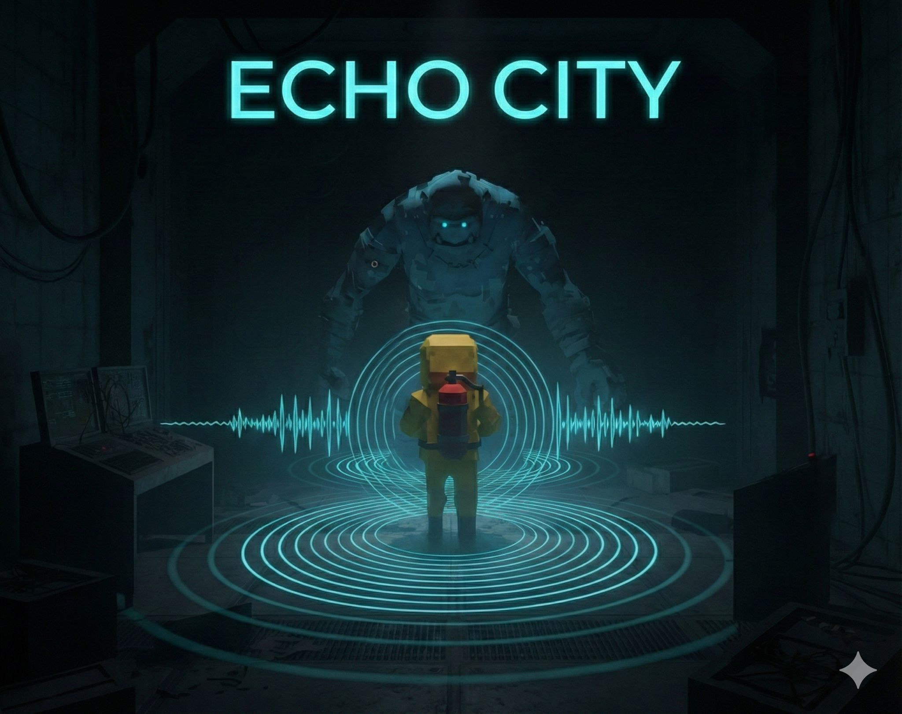
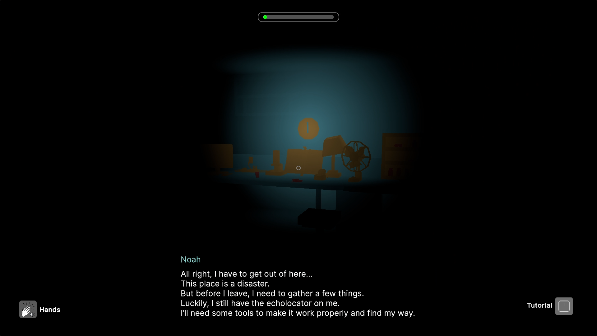
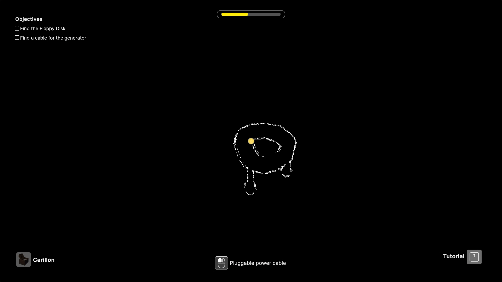
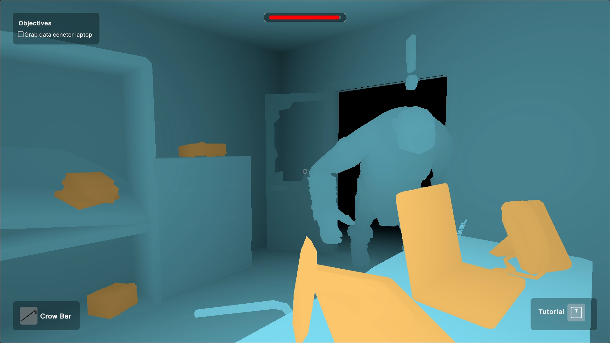
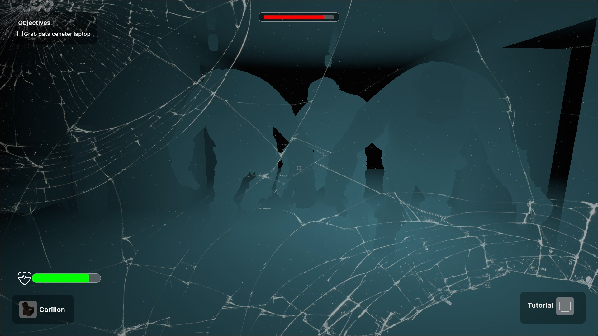
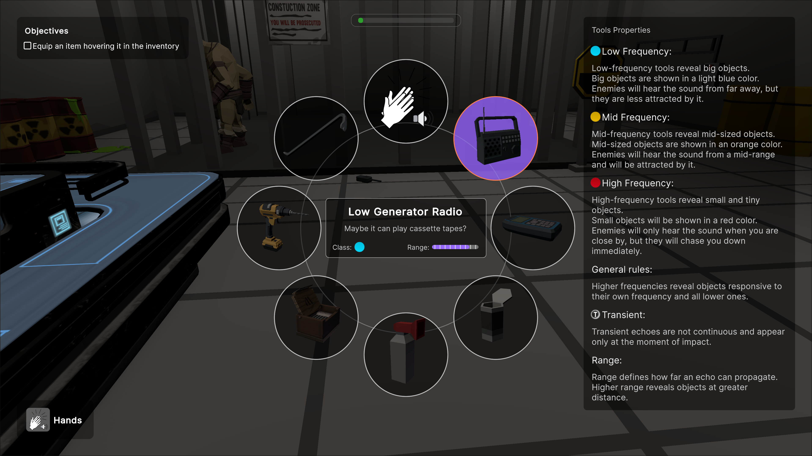

  <h1> ECHO CITY</h1>

  

    
    
    
  

  
<i>A first-person sensory experience in total darkness</i>

  

    
  

  

  

    

      <i>Developed for the <b>Videogame Design and Programming</b> course of the Politecnico di Milano  
      taught by Prof. Pierluca Lanzi & Prof. Daniele Loiacono.</i>
    

  

    

  

    
<h2 align="center">👥 Credits</h2>

  <h3>🏛️ Politecnico di Milano</h3>
  

    <b><a href="https://github.com/Giovanni000">Giovanni Passuello</a></b> (Giovanni000)  
    <b><a href="https://github.com/slaitroc">Lorenzo Ricci</a></b> (slaitroc)  
    <b><a href="https://github.com/OmegaMorello">Marco Moretta</a></b> (OmegaMorello)  
    <b><a href="https://github.com/smuuule">Samuel Karl Runmark</a></b> (smuuule)  
    <b><a href="https://github.com/Jie-S14">Jie Shen</a></b> (Jie-S14)
  

  <h3>🌟 External Collaborations</h3>
  

    <b>Federico Nerozzi</b> — <i>Music & The Disaster FX</i>  
    <b>Alexandru Serban</b> — <i>First area initial environment layout</i>
  

## Echo City - Beta (itch.io description)

**In Echo City, sound is your only sight.**

The world is shrouded in absolute darkness. To survive, you must master the art of **echolocation**: every sound you emit momentarily carves the world out of the shadows.

### 🔊 Seeing Through Sound

Every pulse of noise reconstructs your surroundings for a fleeting second.

- **Frequency Matters:** Different wave frequencies reveal different object scales, from massive walls to intricate tools.

   

- **The Cost of Clarity:** Silence is your only shield, but it leaves you blind and without direction.

   

### 👣 The Risk of Noise

You are not alone in the dark.
The creatures hunting you use the same senses to navigate. They track the intensity and direction of every sound you make. **Every pulse is a tactical choice:** will you risk your position for a moment of vision, or remain hidden and lose your way?

 

---

### 🔦 The Experience

**Echo City** is an experimental first-person horror focused on atmosphere, tension, and discovery.

- **Master the Echo:** Learn to read physical space through acoustic feedback.
- **Disturb the Silence:** Navigate environments that only exist when you disturb them.
- **One Echo at a Time:** Complete high-stakes objectives in a world where your own heartbeat is your greatest enemy.

   

- **Manage Your Resources:** Carefully organize your inventory and key items to overcome the darkness.

   
